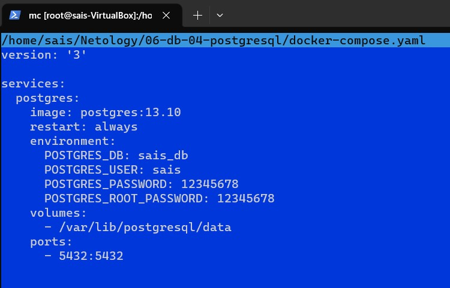

# Домашнее задание к занятию 4. «PostgreSQL»

## Задача 1

Используя Docker, поднимите инстанс PostgreSQL (версию 13). Данные БД сохраните в volume.

Подключитесь к БД PostgreSQL, используя `psql`.

Воспользуйтесь командой `\?` для вывода подсказки по имеющимся в `psql` управляющим командам.

**Найдите и приведите** управляющие команды для:

- вывода списка БД,
  
  
- подключения к БД,
  
  
- вывода списка таблиц,
  
  
- вывода описания содержимого таблиц,
  
  
- выхода из psql.
  
  

## Задача 2

Используя `psql`, создайте БД `test_database`.

Изучите [бэкап БД](https://github.com/netology-code/virt-homeworks/tree/virt-11/06-db-04-postgresql/test_data).

Восстановите бэкап БД в `test_database`.

Перейдите в управляющую консоль `psql` внутри контейнера.

Подключитесь к восстановленной БД и проведите операцию ANALYZE для сбора статистики по таблице.

Используя таблицу [pg_stats](https://postgrespro.ru/docs/postgresql/12/view-pg-stats), найдите столбец таблицы `orders` с наибольшим средним значением размера элементов в байтах.

**Приведите в ответе** команду, которую вы использовали для вычисления, и полученный результат.

## Задача 3

Архитектор и администратор БД выяснили, что ваша таблица orders разрослась до невиданных размеров и поиск по ней занимает долгое время. Вам как успешному выпускнику курсов DevOps в Нетологии предложили провести разбиение таблицы на 2: шардировать на orders_1 - price>499 и orders_2 - price<=499.

Предложите SQL-транзакцию для проведения этой операции.

Можно ли было изначально исключить ручное разбиение при проектировании таблицы orders?

По поводу изначального разбиение  по разным таблицам(я так понимаю цель в автоматическом режиме) исходя из цены можно попробывать это сделать через функциональные индексы. Я вижу это в создании родительской таблицы и 2е дочерние которые автоматически будут раскидывать данные в первую  таблицу до 500 во вторую после 500.

## Задача 4

Используя утилиту `pg_dump`, создайте бекап БД `test_database`.

Как бы вы доработали бэкап-файл, чтобы добавить уникальность значения столбца `title` для таблиц `test_database`?

я бы добавил в строчку **ALTER TABLE test_database ADD CONSTRAINT unique_title UNIQUE (title);** добавив уникальность столбцу
